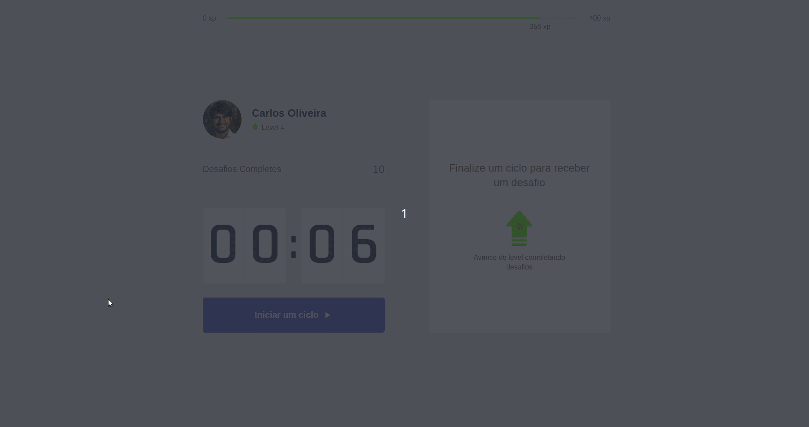

<h1 align="center">
    Move.it
</h1>
<p align="center"> Application developed during the fourth edition of the Next Level Week by <a href="https://rocketseat.com.br/">Rocketseat</a> 🚀 </p>

<h1 align="center">
  
</h1>

##🎯 Objective

Track your time, be more productive and take care of your health. <a href="https://moveit-five-lemon.vercel.app/">Move.it</a> was developed for time management, as in the pomodoro technique, dividing the work into 25 minute periods. After that time it releases a challenge, which is some stretching for the body or exercise for the eyes. Each challenge has its xp points and, accumulating the points you level up.

The Figma layout is available <a href="https://www.figma.com/file/ge20pu3ofMOKoliUyKx1Nl/?viewer=1&node-id=">here</a>.

##🛠 Technologies:

The following tools were used in the construction of the project:

- [ReactJS](https://reactjs.org)
- [NextJS](https://nextjs.org)
- [NodeJS](https://nodejs.org/en/)

## 👷️ Getting Started

These instructions will get you a copy of the project up and running on your local machine for development and testing purposes.

### Prerequisites

You will need to have yarn installed on your machine. For that, simply run:

```bash
npm install -g yarn
```

### Installing

To run the project for the **first** time you must follow this steps:

Clone the GitHub repository

```bash
git clone https://github.com/carlosfoliveira/moveit-next.git
```

Install the dependencies and start the project

```bash
yarn
```

```bash
yarn dev
```

Now, you can see the app running at [localhost:3000](http://localhost:3000)

## 💻️ Author
**Carlos Oliveira** - [carlosfoliveira](https://github.com/carlosfoliveira)

<h2 id="license"> 📝 License </h2>

This project is under the MIT license.


```markdown
Made with `markdown` and love by Carlos Oliveira
```